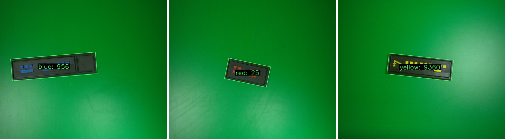

# Coin Detection and Value Decoding — "Galactic Credit Scanner"

A **rule-based computer vision system** that finds coin-like tokens in camera images, checks whether each one is real or fake, and decodes its value from the coloured symbols on it. The system uses no training data. Every step relies on classical image analysis: colour segmentation, contour geometry and metric measurements from a calibrated camera.

> Course project in **Sensor Technology and Image Analysis**, M.Sc. programme in AI and Automation, University West (Högskolan Väst), Sweden (2025–26). Group project. See [Team](#team).



## What it does

Each token is a dark plate carrying small coloured symbols (squares and rectangles). The system:

1. **Captures** an image from a Basler industrial camera (via `pypylon`), a webcam, a video file or a folder of images
2. **Detects** each token and the symbols on it, using CLAHE contrast enhancement and HSV colour segmentation
3. **Measures** the token in millimetres using the camera calibration (pixels per mm)
4. **Validates** the token as *Real* or *Fake* from its physical dimensions and symbol layout
5. **Decodes** the value by classifying symbols, grouping them into rows along the token's long axis, ordering the rows (using a gold reference symbol when present) and mapping each row to a digit

The final value depends on the token colour:

| Colour | Rule |
|--------|------|
| Blue   | digits are concatenated |
| Yellow | digits are concatenated and scaled |
| Red    | digits are multiplied |

## Results

On the sample images, measured token sizes fall within about **1 mm** of the true dimensions (e.g. 38.00 × 114.00 mm expected vs 37.33 × 114.96 mm measured). All four samples are decoded correctly: blue 956, blue 756, red 25 and yellow 9360.

## Pipeline

```
Camera / images ──► ObjectAndSymbolDetector ──► ObjectValidator ──► ValueDecoder ──► GUI overlay
                     (object_detector.py)       (object_validator.py) (value_decoder.py +
                                                                       symbol_classifier.py)
          ▲
   CameraCalibration (camera_calibrator.py) → pixels per mm
```

## Getting started

```bash
git clone https://github.com/shumail9012/coin-detection-value-decoding.git
cd coin-detection-value-decoding
pip install -r requirements.txt
```

**Quick demo (no camera, no GUI):**

```bash
python demo.py            # processes samples/ and writes annotated images to results/
```

**Desktop app:**

```bash
cd src
python static_gui.py      # load an image folder or a video, or start the live camera
```

**Using a live camera:** run the calibration from the GUI with a square marker of known size, then set `PIXELS_PER_MM_X` and `PIXELS_PER_MM_Y` in `src/utility.py`. A Basler camera requires the [Pylon SDK](https://www.baslerweb.com/en/software/pylon/). Without one, the app falls back to OpenCV.

## Repository structure

```
├── demo.py                  # headless demo on sample images
├── src/
│   ├── static_gui.py        # main app (Tkinter)
│   ├── object_detector.py   # token + symbol detection
│   ├── object_validator.py  # real / fake check
│   ├── value_decoder.py     # row formation, ordering, decoding
│   ├── symbol_classifier.py # square / rect2 / rect3 / gold
│   ├── camera.py, camera_calibrator.py, utility.py
│   └── gui.py, frame_procesor.py, adaptive_threshold.py, csrt_tracker.py, ...
│                            # experimental threaded live-view with adaptive resolution and tracking
├── tools/                   # early calibration and shape-measurement prototypes
├── samples/                 # 4 sample images; annotations.csv labels the original ~1 GB dataset (not included)
└── docs/images/
```

## Limitations

- The main app processes frames one at a time at the camera's full resolution, so live mode is slow. The multithreaded, adaptive-resolution live view in `gui.py` is experimental.
- Colour thresholds are tuned for the lab's lighting and green background.
- It is intended for coursework and prototyping, not production.

## Tech stack

Python · OpenCV · NumPy · SciPy · Pillow · Tkinter · pypylon (Basler) · GitHub Actions (Pylint)

## Team

This was a two-person group project. Both members worked across all parts of the system: calibration, detection, validation, decoding and the GUI.

- **Shumail Alam Khan**
- **Suraj Karki** ([@suka1901](https://github.com/suka1901))

The original group repository is [suka1901/sensorTechnologyAndImageAnalysis](https://github.com/suka1901/sensorTechnologyAndImageAnalysis). This repository reorganises that code and adds `demo.py`, sample data and this documentation.

## License

MIT. See [LICENSE](LICENSE).
